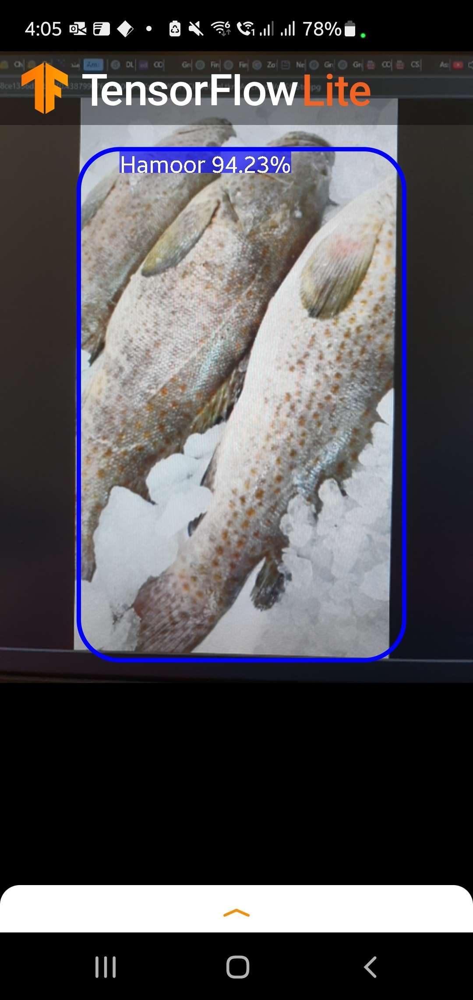
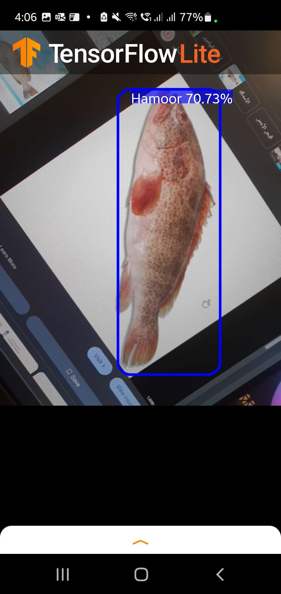
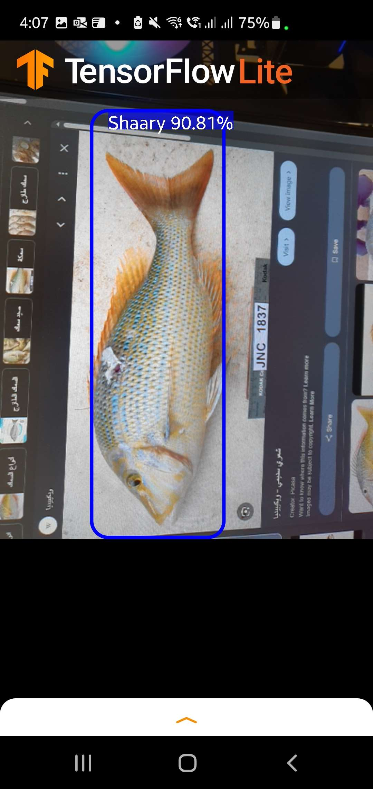

# A Lightweight Neural Network for Real-Time Fish Detection in Saudi Arabia

## 🐟 Introduction

This project addresses a growing need in Saudi Arabia’s fish market. With many unique species that inhabit only the Gulf and Red Seas, customers often struggle to identify fish — especially younger buyers unfamiliar with local names or appearances.

## ❓ Problem Statement

Many fish in Saudi markets have subtle visual differences, making manual identification difficult without prior knowledge. Variations in shape, size, color, and texture make this a visually challenging task. Given this, a deep learning-based image classifier, particularly a Convolutional Neural Network (CNN), is ideal for recognizing fish based on their distinctive features.

## 💡 Proposed Solution

I developed a real-time fish species detection model using TensorFlow’s Object Detection API. This model leverages lightweight architectures (e.g., MobileNet, Mobile DetNet) for efficient deployment on mobile devices. It aims to help customers instantly recognize fish species at the point of sale.

## 🛠️ Tools & Design

- **Data Collection**: Aggregated from search engines, social media, and domain experts.
- **Preprocessing**:
  - Labeled and boxed images manually.
  - Resized and validated images for training.
  - Balanced: each class contains 100–300 images.
- **Dataset Split**: 90% training, 10% validation.
- **Framework**: TensorFlow Object Detection API.

### 🎣 Fish Classes

| Fish Type (Common/Local Name)              |
|--------------------------------------------|
| Greasy Grouper (Hamoor)                    |
| Lethrinus Nebulosus (Sh3ry or Sh3or)       |
| Nemipterus (3andq)                         |
| Pampus Argenteus (Zbeedi)                  |
| Kanaad                                     |
| Siganus Rivulatus (Sijan / Safi)           |

## 📊 Model Results

| SSD Feature Extractor      | Steps | mAP  | Cls Loss | Train Loss | Val Loss | Graph | Inference Time (Galaxy S10+) |
|----------------------------|-------|------|----------|------------|----------|----------|------------------------------|
| ResNet-640                 | 30K   | 0.80 | 0.19     | 0.20       | 0.40     | OK       | 2000ms (Failed to run)       |
| ResNet-512                 | 100K  | 0.72 | 0.24     | 0.15       | 0.37     | Okay     | 3000–3500ms (Failed)         |
| MobileNet_v1_640           | 25K   | 0.82 | 0.29     | 0.38       | 0.64     | Okay     | 1500–4000ms                  |
| **Mobile DetNet 300**      | 100K  | 0.77 | 0.17     | 0.15       | 0.31     | Great    | **< 200ms** ✅               |
| **Inception v2 300**       | 200K  | 0.82 | 1.65     | 1.45       | 2.20     | Unstable | 100–300ms                    |

## 📱 Real-Time Detection Screenshots

  
  
  
  

## ✅ Conclusion

This solution is lightweight, mobile-friendly, and achieves reliable detection speeds (<200ms) on edge devices like the Galaxy S10+. With further tuning and expansion to more fish classes, it can provide real-time identification support for customers across Saudi fish markets.
